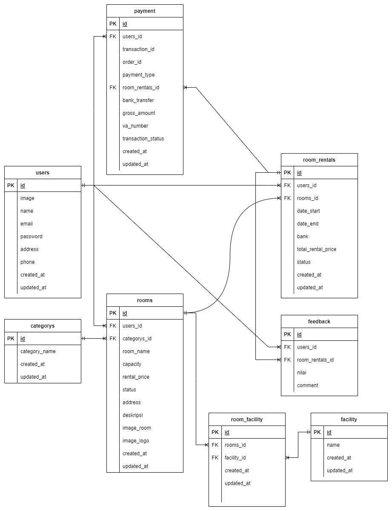

# MN Room - Project Capstone Group 4

<!-- PROJECT LOGO -->
 

<!--  mengarah ke repo  -->
  

<h3 align="center">MN Room</h3>

  

    MN Room Application Capstone Project 4
     
    <a href="https://app.swaggerhub.com/apis-docs/davidwah/MNROOM/1.0#/"><strong>» Open API »</strong></a>
     
  

### 🛠 &nbsp;Build App & Tools

&nbsp;
&nbsp;
&nbsp;
&nbsp;
&nbsp;
&nbsp;
&nbsp;
&nbsp;
&nbsp;

## About Project
**MN-Room** merupakan projek capstone yang muncul berawal dari keresahan seseorang yang sedang menyewa sebuah ruangan untuk keperluan acara. Namun ketika menjelang hari acara ternyata pihak rental gedung/ruangan tersebut menyampaikan kabar bahwa ruangan tersebut sudah disewa oleh orang lain. Dari masalah tersebut terpikirkan sebuah solusi yang harusnya sebuah penyewaan gedung/ruangan mempunyai catatan secara online yang dapat dilihat oleh berbagai user dan dapat juga di pesan secara online, serta menerapkan pembayaran secara online juga melalui payment gateway. Fitur-fitur yang ada pada **MN-Room** sebagai berikut:

      

🙎 Users

  
  <!---
  | Command | Description |
| --- | --- |
  --->
  
 Endpoint User terdapat fitur untuk membuat Akun dan Login agar mendapat mengakses berbagai layanan di aplikasi MN-Room, 
 selain itu terdapat fitur Update untuk mengedit data profile user, serta fitur delete untuk menghapus akun.
 

  
| Feature User | Endpoint | Param | JWT Token | Fungsi |
| --- | --- | --- | --- | --- |
| POST | /signup  | - | NO | Melakukan proses registrasi user |
| POST | /login | - | NO | Melakukan proses login user |
| GET | /users | - | YES | Mendapatkan informasi daftar user terdaftar |
| PUT | /users | - | YES | Melakukan update profile user yang sedang login | 
| DEL | /users | - | YES | Menghapus user yang sedang login |

  

🛍 &nbsp;Room

  
  <!---
  | Command | Description |
| --- | --- |
  --->
  
Pada Room ini user dapat melihat beberapa daftar ruangan dan detail ruangan yang disewakan. Selain itu User juga dapat membuat profile ruangan sendiri yang nantinya akan disewakan. Terdapat beberapa fitur tambahan pada **Room** ini, yaitu *facility* dan *categories* yang bertujuan untuk mengelompokkan ruangan dengan berdasarkan kategori dan menampikan fasilitas yang ada pada ruangan tersebut. Sehingga memudahkan User untuk menentukan pilihan ketika hendak menyewa ruangan.
  
| Feature Products | Endpoint | Param | JWT Token | Fungsi |
| --- | --- | --- | --- | --- |
| POST | /rooms  | - | YES | Membuat rooms profile baru |
| GET | /rooms | - | YES | Mendapatkan informasi seluruh product user yang sedang login |
| GET | /rooms/:id | id | NO | Mendapatkan informasi rooms berdasarkan id-rooms |
| PUT | /rooms | - | YES | Melakukan update profile informasi room |
| GET | /user/rooms | id | NO | Mendapatkan informasi rooms yang terlah dibuat oleh user. |
| DEL | /rooms/:id | id | YES | Melakukan delete rooms tertentu berdasarkan id rooms |

🛒 &nbsp;Rent

  
  <!---
  | Command | Description |
| --- | --- |
  --->
Cart merupakan fitur untuk menampung berbagai product yang akan dibeli oleh user, adapun fiturnya ada GET dimana user bisa melihat barang apa aja yang ada di dalam keranjang, ada fitur history dimana user bisa melihat jumlah product yang sudah dibayar.
  
| Feature cart | Endpoint | Param | JWT Token | Fungsi |
| --- | --- | --- | --- | --- |
| POST | /rents | - | YES | Melakukan sewa pada sebuah rooms |
| GET | /rents | - | YES | Mendapatkan informasi sewa yang telah dilakukan |

🗓&nbsp;Payments

  
  <!---
  | Command | Description |
| --- | --- |
  --->
Merupakan fitur untuk dimana user melakukan pembayaran sesuai sewa room yang dipilih. Mode pembayaran ini menggunakan payment gateway yang disediakan oleh xendit, payment_method yang digunakan pada MN-Room yaitu pembayaran melalui BANK BCA dan BNI. 
  
| Feature booking | Endpoint | Param | JWT Token | Fungsi |
| --- | --- | --- | --- | --- |
| GET | /payments | id | YES | Mendapatkan informasi pembayaran berdasarkan rent id |
| POST | /payments/status | - | NO | Membuat pembayaran sewa ruang |

📈&nbsp;ERD

  

### Contact

